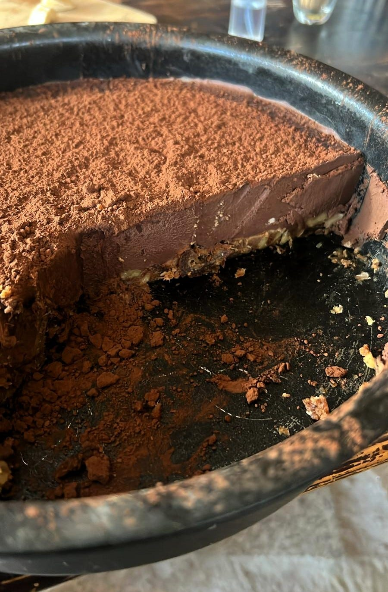

> ## Ingredientes — Base (piso inferior)
> - 250 g de dátiles sin hueso (remojados 10 min si están muy secos)  
> - 120 g de nueces (o cacahuetes tostados, almendras, avellanas...)
> - (Opcional) Medio plátano maduro (si lo tienes por la nevera y no sabes qué hacer con él)
> - (Opcional) Una cucharada de mantequilla de cacahuete (si te falta densidad)
> - Pizca de sal marina (si quieres un punch mágico)

> ## Ingredientes — Capa de chocolate (piso superior)
> - 400 ml de leche de coco (parte entera, si puedes)
> - 200 g de chocolate +70%
> - (Opcional 1/3 y preferido) 10 g de aceite de coco (solidifica al enfriarse y da cuerpo sin perder cremosidad)
> - (Opcional 2/3) 1 cucharada de maicena (Si quieres una textura suave y estable, pero no rígida)
> - (Opcional 3/3) 1 cucharadita de agar-agar (Si quieres que la tarta quede sólida, tirando a gelatina, para transportarla por ejemplo)

> ## Preparación
> 1. Triturar los dátiles hasta obtener una pasta pegajosa.  
> 2. Añadir los cacahuetes (y el plátano si lo usas) y procesar hasta lograr una masa compactable.  
> 3. Forrar el molde con papel vegetal y presionar la mezcla en el fondo.  
> 4. Añadir una pizca de sal a la base.  
> 5. Guardar en el congelador mientras se prepara la capa superior.  
> 6. Calentar la leche de coco sin que llegue a hervir.  
> 7. Añadir el chocolate troceado y mezclar hasta que se funda y quede una crema lisa.  
> 8. (Opcional) Disolver la maicena aparte con un chorrito de leche de coco y añadir para espesar.  
> 9. Dejar templar 3–4 minutos.  
> 10. Verter (con cariño) sobre la base fría y golpear suavemente el molde para eliminar burbujas.  
> 11. Refrigerar al menos 4 horas; idealmente toda la noche.

## Tips 🎨
- (Recomendado)Decora con cacao en polvo o cacahuetes troceados.
- Añade vainilla o ralladura de naranja a la capa de chocolate.  
